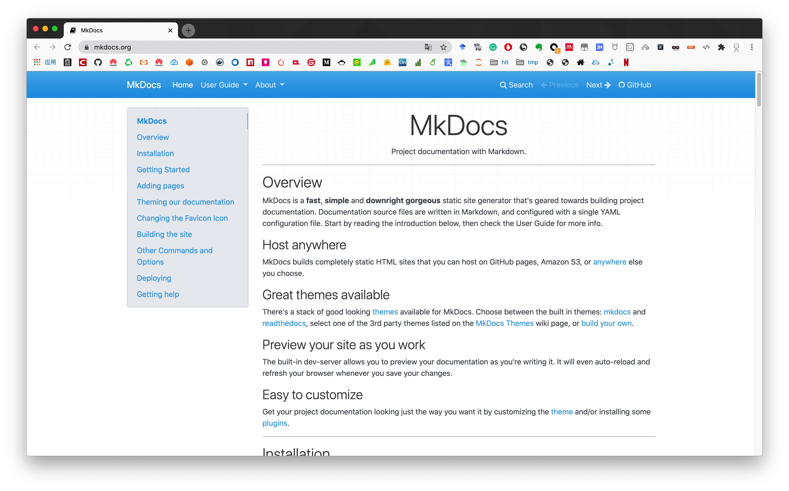
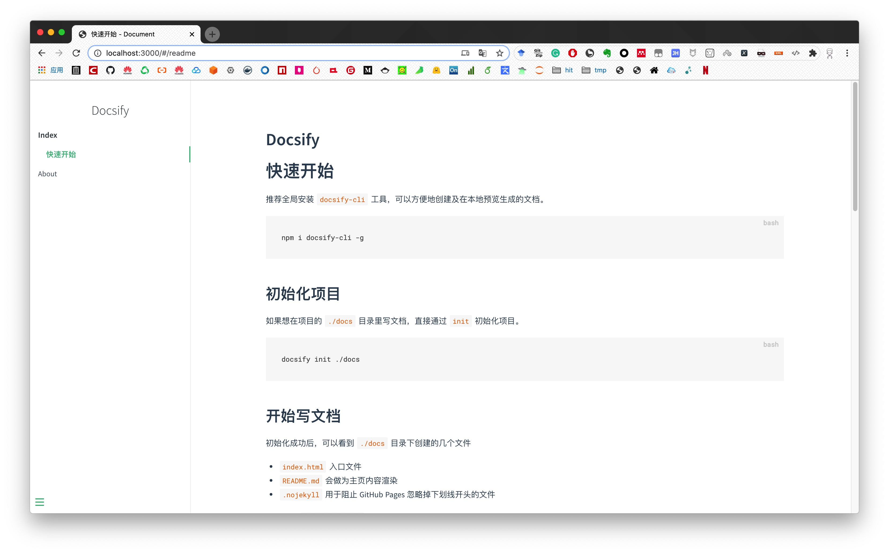
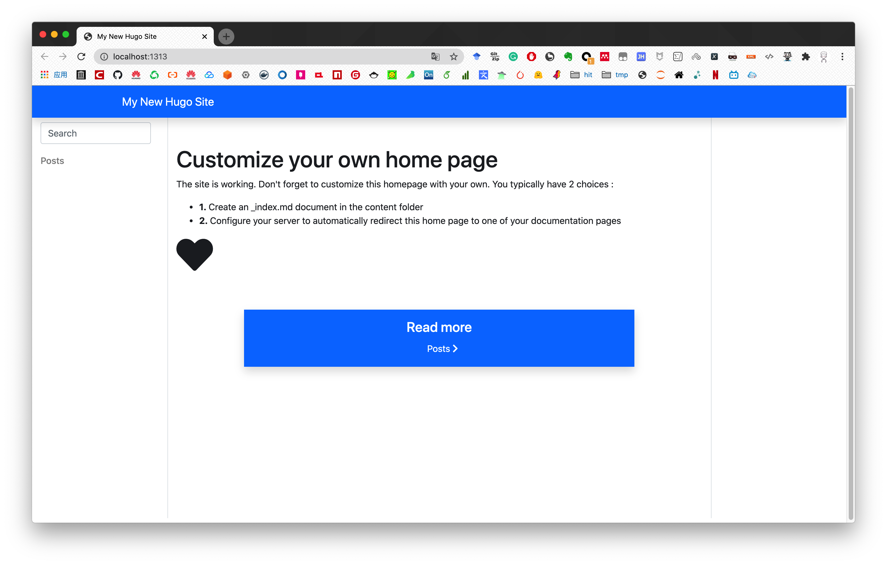

# doc-tools

> 项目文档及静态网站搭建
>
> [docsify-vs-docute-vs-gitbook-vs-vuepress-vs-mkdocs)](https://www.npmtrends.com/docsify-vs-docute-vs-gitbook-vs-vuepress-vs-mkdocs)
>
> [静态网站生成器 Hexo、Gitbook、Vuepress、Docsify、Docute、Nuxt](http://www.amdoing.com/static-site-generator-hexo-gitbook-vuepress-and-so-on/)


- [Mkdocs](https://www.mkdocs.org/)

  - 运行命令

    ```bash
    # 安装
    pip install mkdocs
    
    # 初始化项目
    mkdocs new mkdocs-project
    cd mkdocs-project
    
    # 本地运行
    mkdocs serve
    
    # 编译
    mkdocs build --clean
    ```

  - 演示图片

    

- [docsify](https://docsify.js.org/#/zh-cn/)

  - 运行命令

    ```bash
    # 安装
    npm i docsify-cli -g
    
    # 初始化项目
    docsify init ./docsify-project
    
    # 本地运行
    docsify serve docsify-project
    
    # 编译（免编译）
    ```

  - 演示图片

    

- [Hexo](https://hexo.io/docs/)

  - 运行命令

    ```bash
    # （全局）安装
    npm install -g hexo-cli
    
    # 初始化
    hexo init hexo-project
    cd hexo-project
    npm install
    
    # 创建博客模版
    hexo new post my-post	
    
    # 清理之前静态文件
    hexo clean
    
    # 生成静态文件
    hexo g
    
    # debug 本地运行
    hexo s --debug
    
    # 发布github（安装插件`npm install hexo-deployer-git`；填写配置文件）	
    hexo d -g
    ```
  
- [Hugo](https://gohugo.io/documentation/)

    - 运行命令
      ```bash
      brew install hugo
      
      # 初始化项目
      hugo new site hugo-project
      
      cd hugo-project
      
      # 下载并设置主题
      git init
      git submodule add https://github.com/budparr/gohugo-theme-ananke.git themes/ananke
      echo 'theme = "ananke"' >> config.toml
      
      # 添加博文
      hugo new posts/my-first-post.md
      
      # 预览
      hugo server -D
      
      # publish
      hugo -D
      ```
    
    - 运行效果
      

- [Jekyll](https://jekyllrb.com/docs/)


      - 运行命令

        ```bash
        jekyll new jekyll-project
        
        cd jekyll-project
        
        bundle exec jekyll serve
        ```


    - 参考链接

      - [JAMstack Themes](https://jamstackthemes.dev/themes/)
      - [Jekylltheme.org](http://jekyllthemes.org/)
      - [https://jekyllthemes.io/](https://jekyllthemes.io/)
      


- [VuePress](https://vuepress.vuejs.org/zh/guide/)

  


